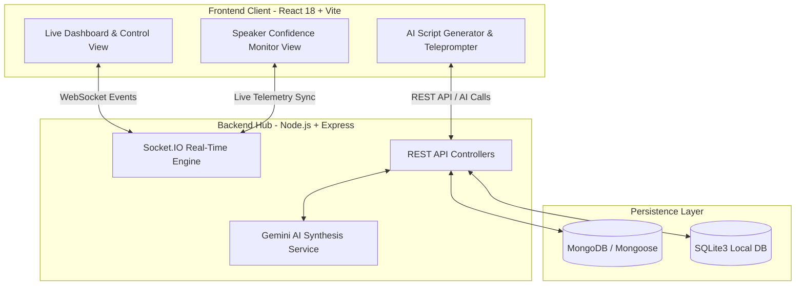

# 🎙️ Smart Anchor & Stage Flow Management System (Haxo-PS5)

> **Real-time AI-powered event orchestration, dynamic teleprompting, stage flow synchronization, and intelligent emergency delay management platform.**

[](https://nodejs.org/)
[](https://expressjs.com/)
[](https://reactjs.org/)
[](https://vitejs.dev/)
[](https://tailwindcss.com/)
[](https://socket.io/)
[](https://www.mongodb.com/)
[](LICENSE)

---

## 📌 Problem Statement & System Overview

Live event hosting, technical conferences, and symposiums frequently face critical operational bottlenecks:
- **Speaker Overruns**: Presenters exceeding allotted talk time without direct, non-intrusive feedback.
- **Cascading Schedule Disruptions**: A single 10-minute delay throwing off the entire day's agenda.
- **Fragmented Stage Communication**: Disconnected touchpoints between backstage operators, stage anchors/emcees, and speakers.
- **Manual Recalculation Overhead**: Organizers manually scrambling to trim breaks, update schedules, and notify staff.

**Smart Anchor & Stage Flow Management System** solves these challenges by providing a full-stack, real-time stage orchestration hub. It unifies event organizers, stage anchors, speakers, and confidence monitors into a single synchronized feedback loop.

---

## ✨ Core Features

### 🎛️ 1. Live Stage Control & Real-Time Telemetry
- **Active Session Telemetry**: Real-time elapsed and remaining countdown timers with visual urgency rings (Green ➔ Amber ➔ Red alert).
- **One-Click Stage Signals**: Send direct control overrides (`+1 Min`, `+2 Min`, `+5 Min`, `Pause`, `Resume`, or `Wrap Up`).
- **Confidence Monitor Sync**: Dedicated live stage views designed for display on speaker monitors and teleprompter setups.

### 🤖 2. AI Script Generator & Dynamic Teleprompter
- **AI Synthesis (Gemini Engine)**: Instantly generate stage intros, smooth topic transitions, emergency holding banter, and concluding remarks tailored to talk topics and tone settings.
- **Full-Screen Teleprompter View**: High-contrast, scalable text display with speed controls, mirror mode, and smooth auto-scrolling for stage hosts.
- **Script Approval Pipeline**: Draft, review, edit, and broadcast approved scripts directly to the anchor's teleprompter feed.

### ⏱️ 3. Intelligent Cascading Delay Manager
- **Automated Agenda Recalculation**: Automatically recalculates and shifts downstream agenda items when an upstream talk overruns.
- **Smart Compression Strategies**: Algorithmic recommendations to compress break times and Q&A slots to bring events back on track.
- **Real-Time Stage Delay Alerts**: Live sync across all connected clients whenever schedule modifications occur.

### 📅 4. Comprehensive Agenda & Speaker Management
- **Full Agenda Lifecycle**: Manage keynotes, panel discussions, lightning talks, and buffer zones across `Upcoming` ➔ `Live` ➔ `Completed` ➔ `Overrun` states.
- **Speaker Profiles**: Store bio metadata, session duration thresholds, talk topics, social links, and deck upload status.

### 🚨 5. Stage Alerts & Emergency Broadcast
- **Instant Stage Overlays**: Push high-priority flash messages directly onto the speaker confidence monitor (e.g., *"Mic check needed"*, *"Wrap up in 30s"*, *"VIP in position"*).
- **Global Emergency Banners**: Synchronized red alert banner overlay visible across all active manager views.

---

## 🏗️ System Architecture



---

## 🛠️ Tech Stack

### **Frontend (`FRONTEND/client`)**
- **Framework**: React 18, Vite 6
- **Styling**: Tailwind CSS, Glassmorphism UI Components
- **Icons**: Lucide React
- **Real-Time Client**: Socket.IO Client

### **Backend (`BACKEND`)**
- **Runtime**: Node.js (v18+)
- **Framework**: Express.js
- **Real-Time Engine**: Socket.IO
- **Databases**: MongoDB (via Mongoose) & SQLite3 (fallback)
- **Email Service**: Nodemailer / SMTP / Brevo API Fallback
- **Logging & Utilities**: Morgan, CORS, Dotenv

---

## 📂 Project Structure

```text
Haxo-PS5-SmartAnchor/
├── package.json               # Root launcher (concurrently runs backend + frontend)
├── README.md                  # Project documentation
├── BACKEND/
│   ├── .env.example           # Environment template
│   ├── package.json           # Backend service dependencies
│   ├── data/                  # SQLite local storage
│   ├── scripts/               # Test runner & utility scripts
│   └── src/
│       ├── server.js          # Express app & Socket.IO server startup
│       ├── config/            # DB configuration (SQLite & MongoDB)
│       ├── routes/            # REST API endpoints
│       ├── services/          # Socket service & AI integration logic
│       └── utils/             # Helper functions & formatting utilities
└── FRONTEND/
    └── client/
        ├── index.html         # HTML entry point
        ├── vite.config.js     # Vite configuration & dev server proxy
        ├── tailwind.config.js # Tailwind CSS theme setup
        ├── package.json       # Frontend dependencies
        └── src/
            ├── App.jsx        # Main application router & view switcher
            ├── main.jsx       # React entry DOM mount
            ├── components/    # Reusable UI components & modals
            ├── views/         # Primary application views
            ├── services/      # API client & socket listeners
            └── utils/         # Helper functions
```

---

## 🚀 Quick Start & Installation

### Prerequisites
- **Node.js**: `v18.0.0` or higher
- **npm**: `v9.0.0` or higher
- *(Optional)* **MongoDB**: Local or MongoDB Atlas URI (falls back to SQLite3 automatically)

---

### Option A: One-Command Full-Stack Setup (Recommended)

1. **Clone the repository:**
   ```bash
   git clone https://github.com/Risheet0/Haxo-PS5-SmartAnchor.git
   cd Haxo-PS5-SmartAnchor
   ```

2. **Install all dependencies (Root, Backend, and Frontend):**
   ```bash
   npm run install:all
   ```

3. **Start both Backend and Frontend concurrently:**
   ```bash
   npm run dev
   ```

   - **Frontend App**: `http://localhost:3000`
   - **Backend API**: `http://localhost:5000`

---

### Option B: Manual Setup

#### 1. Setup Backend
```bash
cd BACKEND
npm install
cp .env.example .env
npm run dev
```

#### 2. Setup Frontend Client
```bash
cd FRONTEND/client
npm install
npm run dev
```

---

## ⚙️ Environment Variables

Create a `.env` file in the `BACKEND/` directory based on `.env.example`:

```env
# Server Port
PORT=5000
NODE_ENV=development

# Database URIs
MONGODB_URI=mongodb://localhost:27017/sasm_database

# SMTP Email Configuration
SMTP_HOST=smtp.gmail.com
SMTP_PORT=465
SMTP_SECURE=true
SMTP_USER=your_email@gmail.com
SMTP_PASS=your_app_password
SENDER_EMAIL=your_email@gmail.com
SENDER_NAME=SASM Stage Manager

# AI Engine Key (Optional)
GEMINI_API_KEY=your_gemini_api_key_here
```

---

## 🔌 API & WebSockets Reference

### Key REST Endpoints

| Endpoint | Method | Description |
| :--- | :--- | :--- |
| `/api/health` | `GET` | Health check & DB connection status |
| `/api/events` | `GET` / `POST` | Retrieve and manage events |
| `/api/agenda` | `GET` / `POST` / `PUT` | Agenda item CRUD & dynamic delay adjustments |
| `/api/speakers` | `GET` / `POST` / `DELETE` | Speaker profile management |
| `/api/announcements` | `GET` / `POST` | Stage announcements & flash message alerts |
| `/api/ai/generate-script` | `POST` | AI-assisted stage script generation |
| `/api/auth` | `POST` | Authentication & user session endpoints |

### WebSocket Events (Socket.IO)

| Event Name | Direction | Payload Description |
| :--- | :--- | :--- |
| `stage:timer-update` | Server ➔ Client | Real-time session elapsed/remaining seconds |
| `stage:signal` | Client ➔ Server | Stage overrides (`+1min`, `wrap-up`, `pause`) |
| `agenda:delay-recalculate` | Server ➔ Client | Shifted timings for downstream agenda slots |
| `emergency:flash` | Client ➔ Server ➔ Stage | Broadcast urgent banner overlay to confidence screen |

---

## 🧪 NPM Scripts Reference

### Root Directory (`/`)

| Command | Description |
| :--- | :--- |
| `npm run install:all` | Installs dependencies across root, `BACKEND`, and `FRONTEND/client` |
| `npm run dev` | Launches Backend (:5000) and Frontend (:3000) concurrently |
| `npm run server` | Launches Backend server only |
| `npm run client` | Launches Frontend Vite client only |

### Backend Directory (`/BACKEND`)

| Command | Description |
| :--- | :--- |
| `npm run dev` | Runs Express server with `--watch` mode |
| `npm run start` | Production Node server execution |
| `npm run test` | Runs the backend test suite |

### Frontend Directory (`/FRONTEND/client`)

| Command | Description |
| :--- | :--- |
| `npm run dev` | Starts Vite local development server with HMR |
| `npm run build` | Compiles optimized production bundle |
| `npm run preview` | Previews production build locally |

---

## 🛡️ Quality & Design Best Practices

- ⚡ **Concurrent Execution**: Single-command development startup for rapid prototyping.
- 🎨 **Modern Glassmorphic Dark UI**: High visibility and high contrast designed specifically for backstage and stage lighting environments.
- 🔄 **Fault-Tolerant Database Fallback**: Automated fallback to SQLite local storage when MongoDB is unavailable.

---

## 👥 Authors & Acknowledgments

- **Risheet0** — *Lead Developer & System Architect*

---

## 📄 License

This project is licensed under the MIT License — see the [LICENSE](LICENSE) file for details.